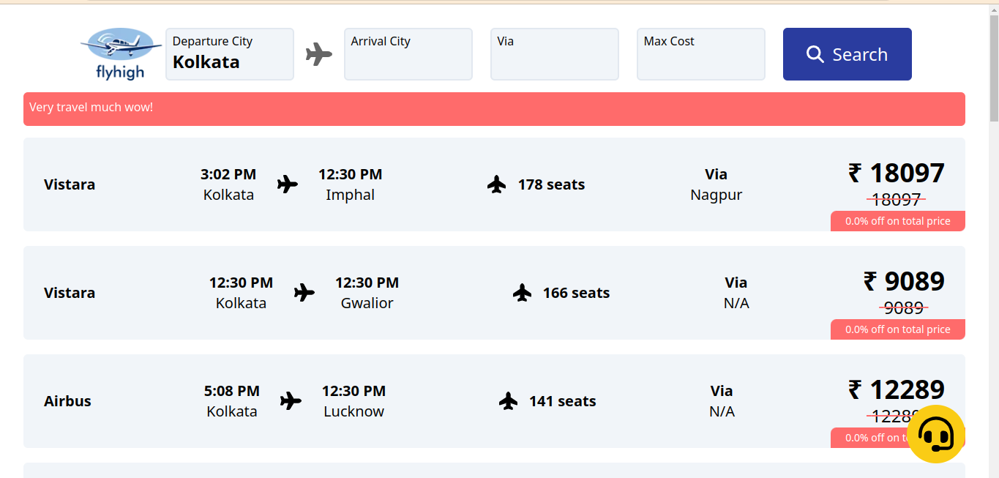
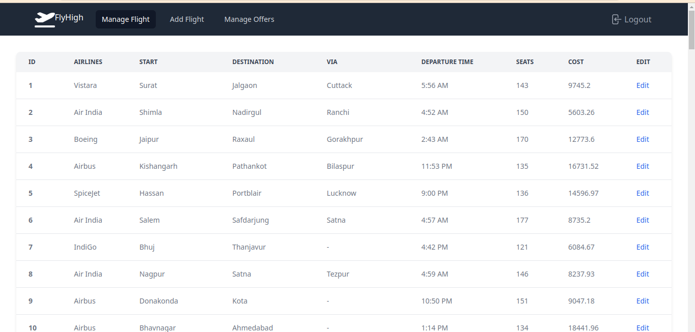

# Flyhigh
- A GraphQL based flight search, query and info web application.
- Role ADMIN has rights to add/modify more flights.
- Also has a chat support using Twilio SDK.
- Here are some screenshots to show the interface:



## Running the app:
- Using `gradle`:
```bash
./gradlew dependencies
./gradlew clean build
```
- Using `docker`:
```
docker build blog:latest .
docker run --rm blog:latest
```
- **OR**
```
docker run --rm heisenberg8622/blog:latest
```
## Run the frontend:
- `npm ci` then `npm run start`

*P.S- Using the provided SQL data entry in raw_data is completely optional, you can add your data instead.*
